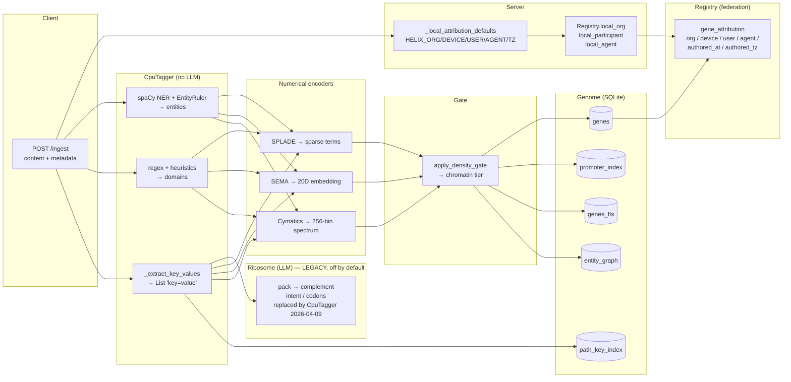
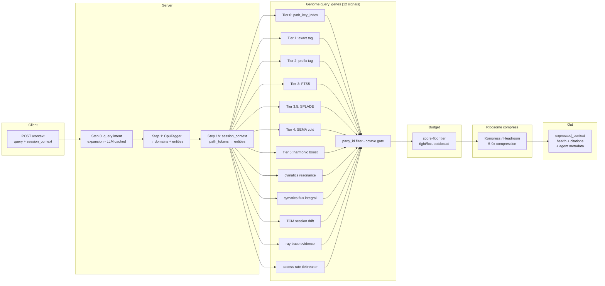

# Pipeline Lanes — Data In / Data Out

> *"Where do tags get added? What tools fire when? Who writes to what?"*

A swim-lane reference for the helix-context pipeline. Two flows
(ingest, query), each broken down by which component does what, what
tools fire, and what gets written / read.

Updated: 2026-04-12, after the 4-layer federation + path_key_index +
timezone forensics commits. LLM-boundary callout added 2026-04-13 to
reflect the live state after the 2026-04-09 CPU pipeline commit and
Sprints 1-4.

---

## LLM boundary (read this first)

```
═════════════════ LLM-FREE ZONE ═════════════════ │ ═══ LLM ═══
                                                  │
ingest → tag → encode → store → query → retrieve  │  /v1/chat/
12 tones + cymatics + TCM + SR + Hebbian          │  completions
(all CPU, deterministic, no model calls)          │  (Claude Haiku
                                                  │   via ribosome)
                                                  │
                  pipeline crosses the boundary ──┘
                  exactly once, at answer generation
```

**Every stage of the data pipeline — `/ingest`, the 12-tone signal stack,
cymatics flux/W1, TCM, SR, theta ray-trace, Hebbian seeded-edges,
splice, the cross-encoder rerank when enabled — runs on pure CPU math
with zero LLM calls.** The only LLM call in the system is at
`/v1/chat/completions`, which consumes the already-built context and
emits the reply. The `ribosome` line in `/stats` reports what *would*
be called if an answer is requested; it is not invoked during ingest
or scoring.

> **Step 0 query-intent expansion — optional, flag-gated.**
> `/context` can invoke `_expand_query_intent()` once per *novel* query
> string (LRU-cached, ~100 tokens out, falls back to the raw query on
> any failure). This is a query rewrite that runs *before* the 12-tone
> stack, not as part of it.
>
> Controlled by `[ribosome] query_expansion_enabled` in `helix.toml`.
> Set to `false` for a strictly LLM-free `/context` pipeline — the 12
> retrieval tiers never need it; they operate on the raw query text +
> synonym map directly. Default is `true` (backwards-compatible with
> pre-2026-04-13 behavior).

This was not always true. Pre-2026-04-09, ingest ran an LLM-based
"pack" step (Ribosome.pack → complement, codons, intent). The 2026-04-09
CPU pipeline commit replaced that with `CpuTagger` (spaCy NER +
EntityRuler + regex KV extraction + extractive summary). Sprints 1-4
(2026-04-13) added W1 cymatics, Howard 2005 TCM with velocity input,
Stachenfeld 2017 SR Tier 5.5, Wang/Foster/Pfeiffer 2020 theta
alternation, and Hebbian seeded-edges — all CPU, all flag-gated.

The math citations behind the LLM-free pipeline:

- Werman, Peleg, Rosenfeld (1986) — circular W1 histogram distance
- Howard & Kahana (2002); Howard, Fotedar, Datey, Hasselmo (2005) — TCM
- Dayan (1993); Stachenfeld, Botvinick, Gershman (2017) — SR
- Wang, Foster, Pfeiffer (2020) — theta forward/backward alternation
- Singh et al. (2020) — Context Mover's Distance (CMD)
- Metodiev, Nachman, Thaler (2017) — CWoLa (Sprint 3, deferred)

---

## Component map (the lanes)

```
CLIENT  ────►  SERVER  ────►  TAGGER  ────►  ENCODERS  ────►  GENOME (DB)
                  │              │              │                │
                  └─► REGISTRY ◄─┴──────────────┴────────────────┘
                       (orgs / parties / participants / agents /
                        gene_attribution + tz)
```

Lanes:

- **CLIENT** — IDE plugin / proxy / curl / your code
- **SERVER** — `helix_context/server.py` FastAPI endpoints
- **TAGGER** — `helix_context/tagger.py` CpuTagger (no LLM, default)
- **RIBOSOME** — `helix_context/ribosome.py` answer-generation only
  (Claude Haiku via `[ribosome] backend = "claude"`); **not on the
  ingest path** since 2026-04-09 CPU pipeline commit
- **ENCODERS** — SPLADE / SEMA / cymatics (numerical, deterministic)
- **GENOME** — SQLite tables: `genes`, `promoter_index`, `genes_fts`,
  `entity_graph`, `path_key_index`
- **REGISTRY** — federation tables: `orgs`, `parties`, `participants`,
  `agents`, `gene_attribution`

---

## INGEST flow



### ASCII fallback (ingest)

```
client POST /ingest
  │
  ├─► Server: _local_attribution_defaults()         env vars + os
  │   └─► Registry.local_org/participant/agent      (registry tables)
  │
  ├─► CpuTagger ─► entities       (spaCy NER + EntityRuler)
  │             ─► domains        (regex)
  │             ─► key_values     ("key=value" list)
  │
  ├─► Ribosome.pack ─► complement   (LLM — LEGACY, replaced by
  │                ─► codons          CpuTagger extractive summary
  │                ─► intent          on 2026-04-09; not invoked
  │                                   on the live ingest path)
  │
  ├─► Encoders  ─► SPLADE sparse    (ModernBERT, deterministic)
  │             ─► SEMA 20D
  │             ─► cymatics 256-bin spectrum
  │
  ├─► Density gate ─► chromatin tier  (open/euchro/heterochro)
  │
  └─► WRITES:
        genes, promoter_index, genes_fts,
        entity_graph, path_key_index,
        gene_attribution (org/dev/user/agent/tz/at)
```

---

## QUERY flow



### ASCII fallback (query)

```
client POST /context (query, session_context)
  │
  ├─► Step 0: _expand_query_intent()        (LLM, cached)
  ├─► Step 1: CpuTagger.extract              → domains+entities
  ├─► Step 1b: session_context path_tokens   → injected into entities
  │
  ├─► Genome.query_genes (12 signals + 1 octave gate):
  │     Tier 0  path_key_index            (PKI compound, IDF-weighted)
  │     Tier 1  exact promoter tag        (3.0)
  │     Tier 2  prefix promoter tag       (1.5)
  │     Tier 3  FTS5 content              (≤6.0 cap)
  │     Tier 3.5 SPLADE sparse            (≤3.5)
  │     Tier 4  SEMA cold-tier            (cosine fallback)
  │     Tier 5  harmonic boost            (≤3.0)
  │     +     cymatics resonance          (Gaussian overlap)
  │     +     cymatics flux integral      (∫ B⃗·dA⃗)
  │     +     TCM session drift           (Howard&Kahana)
  │     +     ray-trace evidence          (Monte Carlo)
  │     +     access-rate tiebreaker      (≤0.25)
  │     gate: party_id filter             (octave - same shape, new identity)
  │
  ├─► Score-floor budget tier:
  │     top_score ≥ 5.0 + ratio ≥ 3.0  → tight  (3 genes, 6k tokens)
  │     top_score ≥ 2.5 + ratio ≥ 1.8  → focused (6 genes, 9k tokens)
  │     else                            → broad  (12 genes, 15k tokens)
  │
  ├─► Step 3:    cymatics blend bonus
  ├─► Step 3.20: harmonic bin boost (overtone series read)
  ├─► Step 3.25: TCM session re-sort
  │
  ├─► Step 4: Ribosome compress (Kompress/Headroom)
  │
  └─► RETURN: expressed_context + citations + 4-axis attribution
```

---

## Where each kind of tag happens

| Tag type | Source | Created at | Used at |
|---|---|---|---|
| `domains` | regex + heuristics in CpuTagger | ingest | Tiers 1, 2, 3 |
| `entities` | spaCy NER + EntityRuler | ingest | Tiers 1, 2, 3, entity_graph |
| `key_values` | regex `key=value` extractor | ingest | path_key_index, ellipticity health |
| `complement` | Ribosome LLM | ingest | retrieval display only (not score) |
| `codons` | Ribosome LLM | ingest | expressed_context formatting |
| `path_token` | `path_tokens(source_id)` | ingest | path_key_index Tier 0 |
| `cymatics spectrum` | term-hashed Gaussian | ingest | resonance + flux + harmonic bins |
| `embedding (SEMA)` | sentence-transformer | ingest | Tier 4 cold-tier |
| `SPLADE terms` | ModernBERT sparse | ingest | Tier 3.5 |
| `chromatin tier` | density_gate at ingest | ingest | hot/warm/cold partitioning |
| `attribution row` | `Registry.attribute_gene` | ingest | filter scoping + audit |

---

## Read paths (where each table is touched at query time)

| Table | Tier(s) that read it | Purpose |
|---|---|---|
| `path_key_index` | Tier 0 | compound (path, key) lookup |
| `promoter_index` | Tier 1, Tier 2 | tag exact / prefix match |
| `genes_fts` | Tier 3 | FTS5 full-text |
| `genes.embedding` | Tier 4 | SEMA cold-tier cosine scan |
| `harmonic_links` | Tier 5 | mutual reinforcement |
| `entity_graph` | post-rank | co-activation pull-forward |
| `gene_attribution` | filter | party_id scoping (the octave gate) |
| `genes.epigenetics` | tiebreaker | access-rate / recent_accesses ring |
| `agents` | citation | enrich /context citations with agent handle |
| `parties` | citation | enrich /context citations with party + tz |
| `orgs` | post-query analytics | cross-tenant aggregation |

---

## Companion docs

- [`FEDERATION_LOCAL.md`](FEDERATION_LOCAL.md) — the 4-layer + tz attribution model that every ingest writes through
- [`MUSIC_OF_RETRIEVAL.md`](MUSIC_OF_RETRIEVAL.md) — why the 12 signals + 1 octave gate is the chromatic structure
- [`DIMENSIONS.md`](DIMENSIONS.md) — formal retrieval dimension inventory
- [`MISSION.md`](MISSION.md) — the substrate-level philosophy
- [`FUTURE/LANGUAGE_AT_THE_EDGES.md`](FUTURE/LANGUAGE_AT_THE_EDGES.md) — math in the middle, language at the edges (the design north-star this pipeline is converging toward)
